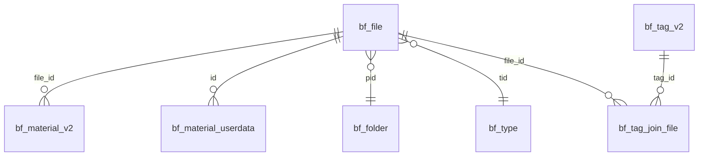

# Billfish 数�库结��考手�

## 概述

Billfish使用SQLite3数�库存储文件索引�标签�用户设置等信�。本文档详细分�`.bf/billfish.db`的表结��字段�义和关系映射�

---

## 核心表结�

### 1. bf_file (主文件表)
**用�*: 存储所有文件的基础信�

| 字段 | 类� | 说� | 示例 |
|------|------|------|------|
| `id` | INTEGER PRIMARY KEY | 文件唯一标识�| 364 |
| `name` | TEXT | 文件�| "00000-0009.mp4" |
| `pid` | INTEGER | 父文件夹ID，关�bf_folder.id | 85 |
| `tid` | INTEGER | 文件类�ID，关�bf_type.tid | 3 |
| `file_size` | INTEGER | 文件大�(字节) | 102271 |
| `ctime` | INTEGER | 创建时间�| 1728983316 |
| `mtime` | INTEGER | 修改时间�| 1728983316 |
| `is_hide` | INTEGER | ��状�(0=显示, 1=��) | 0 |

### 2. bf_material_v2 (系统元数�表)
**用�*: 存储Billfish系统生�的技术信�

| 字段 | 类� | 说� | 示例 |
|------|------|------|------|
| `file_id` | INTEGER | 关�bf_file.id | 364 |
| `thumb_tid` | INTEGER | 系统缩略图ID | 60 |
| `image_tid` | INTEGER | 系统图片ID | 60 |
| `w` | INTEGER | 宽度(�素) | 480 |
| `h` | INTEGER | 高度(�素) | 270 |
| `status` | INTEGER | 处�状�| 1 |
| `is_recycle` | INTEGER | �收站状�| 0 |

### 3. bf_material_userdata (用户扩展数��
**用�*: 存储用户设置的扩展信�和自定义内�

| 字段 | 类� | 说� | 示例 |
|------|------|------|------|
| `id` | INTEGER | 关�bf_file.id | 364 |
| `width` | INTEGER | 用户设置宽度 | 480 |
| `height` | INTEGER | 用户设置高度 | 270 |
| `origin` | TEXT | ��链� | "https://rzx.me" |
| `colors` | TEXT | 颜色信�(JSON) | `["#F5F5F5","#8B8B8B",...]` |
| `cover_tid` | INTEGER | **自定义缩略图标识** | 10 |
| `remarks` | TEXT | 备注信� | "�市水水水水" |

**��字段说�**:
- `cover_tid = 10`: 表示用户设置了自定义缩略�
- `colors`: JSON数组，存储主�颜色的�六进制�
- `origin`: 用户�设置的��URL，支�点击跳�

### 4. bf_folder (文件夹表)
**用�*: 存储文件夹结�

| 字段 | 类� | 说� | 示例 |
|------|------|------|------|
| `id` | INTEGER PRIMARY KEY | 文件夹唯一标识 | 85 |
| `name` | TEXT | 文件夹��| "test-ex" |
| `pid` | INTEGER | 父文件夹ID | 0 |
| `ctime` | INTEGER | 创建时间�| 1728983316 |

### 5. bf_type (文件类��
**用�*: 存储文件类�定义

| 字段 | 类� | 说� | 示例 |
|------|------|------|------|
| `tid` | INTEGER PRIMARY KEY | 类�唯一标识 | 3 |
| `name` | TEXT | 类��称 | "mp4" |

### 6. bf_tag_v2 (标签� �
**用�*: 存储真�标签数�

| 字段 | 类� | 说� | 示例 |
|------|------|------|------|
| `id` | INTEGER PRIMARY KEY | 标签唯一标识 | 4 |
| `name` | TEXT | 标签�称 | "测试更�" |
| `color` | TEXT | 标签颜色 | "#FF5722" |

**⚠� ����**: `bf_tag`表为空，真�标签数�在`bf_tag_v2`表中�

### 7. bf_tag_join_file (标签关��
**用�*: 建立标签�文件的多对多关�

| 字段 | 类� | 说� | 示例 |
|------|------|------|------|
| `tag_id` | INTEGER | 关�bf_tag_v2.id | 4 |
| `file_id` | INTEGER | 关�bf_file.id | 364 |

---

## 表关系图



---

## 预览图存储机�

### 目录结�
```
.bf/
├── .preview/
�  ├── 00/          # file_id % 256 == 0
�  ├── 01/          # file_id % 256 == 1
�  ├── 02/          # file_id % 256 == 2
�  ├── ...
�  ├── 6c/          # � 364 % 256 = 108 = 0x6c
�  └── ff/          # file_id % 256 == 255
└── billfish.db
```

### 文件命�规则�优先级

#### 自定义缩略图 (用户设置)
```
{file_id}.cover.png      # 优先� 1 (最�
{file_id}.cover.webp     # 优先� 2
```

#### 默认缩略�(系统生�)
```
{file_id}.small.webp     # 优先� 3
{file_id}.hd.webp        # 优先� 4 (最�
```

### 哈希分片算法
```php
// 计算预览图目�
$fileId = 364;
$hexFolder = sprintf("%02x", $fileId % 256);  // 364 % 256 = 108 = "6c"
$previewDir = ".bf/.preview/{$hexFolder}/";   // .bf/.preview/6c/

// 检查缩略图优先�
$extensions = ['.cover.png', '.cover.webp', '.small.webp', '.hd.webp'];
foreach ($extensions as $ext) {
    $path = $previewDir . $fileId . $ext;
    if (file_exists($path)) {
        return $path; // 返�第一个找到的文件
    }
}
```

### 自定义缩略图检�
```sql
-- 检查文件是�有自定义缩略图
SELECT cover_tid FROM bf_material_userdata WHERE id = 364;
-- 返� 10 表示有自定义缩略图，NULL 表示使用默认
```

---

## 常用SQL查询模�

### 1. 完整文件信�查询
```sql
SELECT 
    f.id,
    f.name,
    f.file_size,
    f.ctime,
    f.mtime,
    fo.name as folder_name,
    t.name as type_name,
    mv2.w,
    mv2.h,
    mud.origin,
    mud.colors,
    mud.remarks,
    mud.cover_tid
FROM bf_file f
LEFT JOIN bf_folder fo ON f.pid = fo.id
LEFT JOIN bf_type t ON f.tid = t.tid
LEFT JOIN bf_material_v2 mv2 ON f.id = mv2.file_id
LEFT JOIN bf_material_userdata mud ON f.id = mud.id
WHERE f.is_hide = 0;
```

### 2. 标签查询 (使用真�标签�
```sql
-- ��所有标�
SELECT id, name, color FROM bf_tag_v2;

-- ��文件的所有标�
SELECT tv2.id, tv2.name, tv2.color
FROM bf_tag_join_file tjf
LEFT JOIN bf_tag_v2 tv2 ON tjf.tag_id = tv2.id
WHERE tjf.file_id = 364;

-- ��特定标签的所有文�
SELECT f.*, tv2.name as tag_name
FROM bf_file f
INNER JOIN bf_tag_join_file tjf ON f.id = tjf.file_id
LEFT JOIN bf_tag_v2 tv2 ON tjf.tag_id = tv2.id
WHERE tjf.tag_id = 4 AND f.is_hide = 0;
```

### 3. 颜色数�解�
```php
// 解�颜色JSON数�
$colorsJson = '["#F5F5F5","#8B8B8B","#4A4A4A","#2F2F2F","#1A1A1A"]';
$colors = json_decode($colorsJson, true);
foreach ($colors as $color) {
    echo "<span style='background-color: {$color}'></span>";
}
```

---

## 数�类�说�

### 时间戳格�
```php
// Billfish使用Unix时间�
$timestamp = 1728983316;
$datetime = date('Y-m-d H:i:s', $timestamp);  // "2024-10-15 12:28:36"
```

### 布尔值表�
```
0 = false (显示/正常)
1 = true (��/�收�
```

### JSON数�格�
```json
// colors字段示例
["#F5F5F5", "#8B8B8B", "#4A4A4A", "#2F2F2F", "#1A1A1A"]
```

---

## 性能优化�点

### 1. 索引建议
```sql
-- 基础查询索引
CREATE INDEX idx_file_hide ON bf_file(is_hide);
CREATE INDEX idx_file_type ON bf_file(tid);
CREATE INDEX idx_file_folder ON bf_file(pid);

-- 标签查询索引
CREATE INDEX idx_tag_join_file ON bf_tag_join_file(file_id);
CREATE INDEX idx_tag_join_tag ON bf_tag_join_file(tag_id);
```

### 2. 查询优化
- 始终使用 `WHERE f.is_hide = 0` 过滤��文件
- 标签过滤时使�`INNER JOIN` 而� `LEFT JOIN`
- 大�数�时考虑分页查询

### 3. 预览图缓�
- 使用文件修改时间作为缓存版本�制
- 优先检查自定义缩略图存在�
- 分片目录�供O(1)文件定�性能

---

## 版本兼容�

| Billfish版本 | 数�库特�| 兼容�|
|--------------|------------|--------|
| v1.x | 使用bf_tag�| 需�适� |
| v2.x+ | 使用bf_tag_v2�| ��� |

**当å‰�å�‘ç�°**: 测试ç�¯å¢ƒä¸­`bf_tag`表为空，所有标签数æ�®åœ¨`bf_tag_v2`表中，建议优先使用v2表结æ�„ã€

