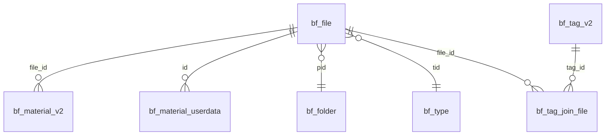

# Billfish 数据库结构参考手�?

## 概述

Billfish使用SQLite3数据库存储文件索引、标签、用户设置等信息。本文档详细分析`.bf/billfish.db`的表结构、字段含义和关系映射�?

---

## 核心表结�?

### 1. bf_file (主文件表)
**用�?*: 存储所有文件的基础信息

| 字段 | 类型 | 说明 | 示例 |
|------|------|------|------|
| `id` | INTEGER PRIMARY KEY | 文件唯一标识�?| 364 |
| `name` | TEXT | 文件�?| "00000-0009.mp4" |
| `pid` | INTEGER | 父文件夹ID，关联bf_folder.id | 85 |
| `tid` | INTEGER | 文件类型ID，关联bf_type.tid | 3 |
| `file_size` | INTEGER | 文件大小(字节) | 102271 |
| `ctime` | INTEGER | 创建时间�?| 1728983316 |
| `mtime` | INTEGER | 修改时间�?| 1728983316 |
| `is_hide` | INTEGER | 隐藏状�?(0=显示, 1=隐藏) | 0 |

### 2. bf_material_v2 (系统元数据表)
**用�?*: 存储Billfish系统生成的技术信�?

| 字段 | 类型 | 说明 | 示例 |
|------|------|------|------|
| `file_id` | INTEGER | 关联bf_file.id | 364 |
| `thumb_tid` | INTEGER | 系统缩略图ID | 60 |
| `image_tid` | INTEGER | 系统图片ID | 60 |
| `w` | INTEGER | 宽度(像素) | 480 |
| `h` | INTEGER | 高度(像素) | 270 |
| `status` | INTEGER | 处理状�?| 1 |
| `is_recycle` | INTEGER | 回收站状�?| 0 |

### 3. bf_material_userdata (用户扩展数据�?
**用�?*: 存储用户设置的扩展信息和自定义内�?

| 字段 | 类型 | 说明 | 示例 |
|------|------|------|------|
| `id` | INTEGER | 关联bf_file.id | 364 |
| `width` | INTEGER | 用户设置宽度 | 480 |
| `height` | INTEGER | 用户设置高度 | 270 |
| `origin` | TEXT | 来源链接 | "https://rzx.me" |
| `colors` | TEXT | 颜色信息(JSON) | `["#F5F5F5","#8B8B8B",...]` |
| `cover_tid` | INTEGER | **自定义缩略图标识** | 10 |
| `remarks` | TEXT | 备注信息 | "城市水水水水" |

**重要字段说明**:
- `cover_tid = 10`: 表示用户设置了自定义缩略�?
- `colors`: JSON数组，存储主要颜色的十六进制�?
- `origin`: 用户可设置的来源URL，支持点击跳�?

### 4. bf_folder (文件夹表)
**用�?*: 存储文件夹结�?

| 字段 | 类型 | 说明 | 示例 |
|------|------|------|------|
| `id` | INTEGER PRIMARY KEY | 文件夹唯一标识 | 85 |
| `name` | TEXT | 文件夹名�?| "test-ex" |
| `pid` | INTEGER | 父文件夹ID | 0 |
| `ctime` | INTEGER | 创建时间�?| 1728983316 |

### 5. bf_type (文件类型�?
**用�?*: 存储文件类型定义

| 字段 | 类型 | 说明 | 示例 |
|------|------|------|------|
| `tid` | INTEGER PRIMARY KEY | 类型唯一标识 | 3 |
| `name` | TEXT | 类型名称 | "mp4" |

### 6. bf_tag_v2 (标签�? �?
**用�?*: 存储真实标签数据

| 字段 | 类型 | 说明 | 示例 |
|------|------|------|------|
| `id` | INTEGER PRIMARY KEY | 标签唯一标识 | 4 |
| `name` | TEXT | 标签名称 | "测试更名" |
| `color` | TEXT | 标签颜色 | "#FF5722" |

**⚠️ 重要发现**: `bf_tag`表为空，真实标签数据在`bf_tag_v2`表中�?

### 7. bf_tag_join_file (标签关联�?
**用�?*: 建立标签与文件的多对多关�?

| 字段 | 类型 | 说明 | 示例 |
|------|------|------|------|
| `tag_id` | INTEGER | 关联bf_tag_v2.id | 4 |
| `file_id` | INTEGER | 关联bf_file.id | 364 |

---

## 表关系图



---

## 预览图存储机�?

### 目录结构
```
.bf/
├── .preview/
�?  ├── 00/          # file_id % 256 == 0
�?  ├── 01/          # file_id % 256 == 1
�?  ├── 02/          # file_id % 256 == 2
�?  ├── ...
�?  ├── 6c/          # �? 364 % 256 = 108 = 0x6c
�?  └── ff/          # file_id % 256 == 255
└── billfish.db
```

### 文件命名规则与优先级

#### 自定义缩略图 (用户设置)
```
{file_id}.cover.png      # 优先�? 1 (最�?
{file_id}.cover.webp     # 优先�? 2
```

#### 默认缩略�?(系统生成)
```
{file_id}.small.webp     # 优先�? 3
{file_id}.hd.webp        # 优先�? 4 (最�?
```

### 哈希分片算法
```php
// 计算预览图目�?
$fileId = 364;
$hexFolder = sprintf("%02x", $fileId % 256);  // 364 % 256 = 108 = "6c"
$previewDir = ".bf/.preview/{$hexFolder}/";   // .bf/.preview/6c/

// 检查缩略图优先�?
$extensions = ['.cover.png', '.cover.webp', '.small.webp', '.hd.webp'];
foreach ($extensions as $ext) {
    $path = $previewDir . $fileId . $ext;
    if (file_exists($path)) {
        return $path; // 返回第一个找到的文件
    }
}
```

### 自定义缩略图检�?
```sql
-- 检查文件是否有自定义缩略图
SELECT cover_tid FROM bf_material_userdata WHERE id = 364;
-- 返回 10 表示有自定义缩略图，NULL 表示使用默认
```

---

## 常用SQL查询模式

### 1. 完整文件信息查询
```sql
SELECT 
    f.id,
    f.name,
    f.file_size,
    f.ctime,
    f.mtime,
    fo.name as folder_name,
    t.name as type_name,
    mv2.w,
    mv2.h,
    mud.origin,
    mud.colors,
    mud.remarks,
    mud.cover_tid
FROM bf_file f
LEFT JOIN bf_folder fo ON f.pid = fo.id
LEFT JOIN bf_type t ON f.tid = t.tid
LEFT JOIN bf_material_v2 mv2 ON f.id = mv2.file_id
LEFT JOIN bf_material_userdata mud ON f.id = mud.id
WHERE f.is_hide = 0;
```

### 2. 标签查询 (使用真实标签�?
```sql
-- 获取所有标�?
SELECT id, name, color FROM bf_tag_v2;

-- 获取文件的所有标�?
SELECT tv2.id, tv2.name, tv2.color
FROM bf_tag_join_file tjf
LEFT JOIN bf_tag_v2 tv2 ON tjf.tag_id = tv2.id
WHERE tjf.file_id = 364;

-- 获取特定标签的所有文�?
SELECT f.*, tv2.name as tag_name
FROM bf_file f
INNER JOIN bf_tag_join_file tjf ON f.id = tjf.file_id
LEFT JOIN bf_tag_v2 tv2 ON tjf.tag_id = tv2.id
WHERE tjf.tag_id = 4 AND f.is_hide = 0;
```

### 3. 颜色数据解析
```php
// 解析颜色JSON数据
$colorsJson = '["#F5F5F5","#8B8B8B","#4A4A4A","#2F2F2F","#1A1A1A"]';
$colors = json_decode($colorsJson, true);
foreach ($colors as $color) {
    echo "<span style='background-color: {$color}'></span>";
}
```

---

## 数据类型说明

### 时间戳格�?
```php
// Billfish使用Unix时间�?
$timestamp = 1728983316;
$datetime = date('Y-m-d H:i:s', $timestamp);  // "2024-10-15 12:28:36"
```

### 布尔值表�?
```
0 = false (显示/正常)
1 = true (隐藏/回收�?
```

### JSON数据格式
```json
// colors字段示例
["#F5F5F5", "#8B8B8B", "#4A4A4A", "#2F2F2F", "#1A1A1A"]
```

---

## 性能优化要点

### 1. 索引建议
```sql
-- 基础查询索引
CREATE INDEX idx_file_hide ON bf_file(is_hide);
CREATE INDEX idx_file_type ON bf_file(tid);
CREATE INDEX idx_file_folder ON bf_file(pid);

-- 标签查询索引
CREATE INDEX idx_tag_join_file ON bf_tag_join_file(file_id);
CREATE INDEX idx_tag_join_tag ON bf_tag_join_file(tag_id);
```

### 2. 查询优化
- 始终使用 `WHERE f.is_hide = 0` 过滤隐藏文件
- 标签过滤时使�?`INNER JOIN` 而非 `LEFT JOIN`
- 大量数据时考虑分页查询

### 3. 预览图缓�?
- 使用文件修改时间作为缓存版本控制
- 优先检查自定义缩略图存在�?
- 分片目录提供O(1)文件定位性能

---

## 版本兼容�?

| Billfish版本 | 数据库特�?| 兼容�?|
|--------------|------------|--------|
| v1.x | 使用bf_tag�?| 需要适配 |
| v2.x+ | 使用bf_tag_v2�?| �?推荐 |

**当前发现**: 测试环境中`bf_tag`表为空，所有标签数据在`bf_tag_v2`表中，建议优先使用v2表结构�

